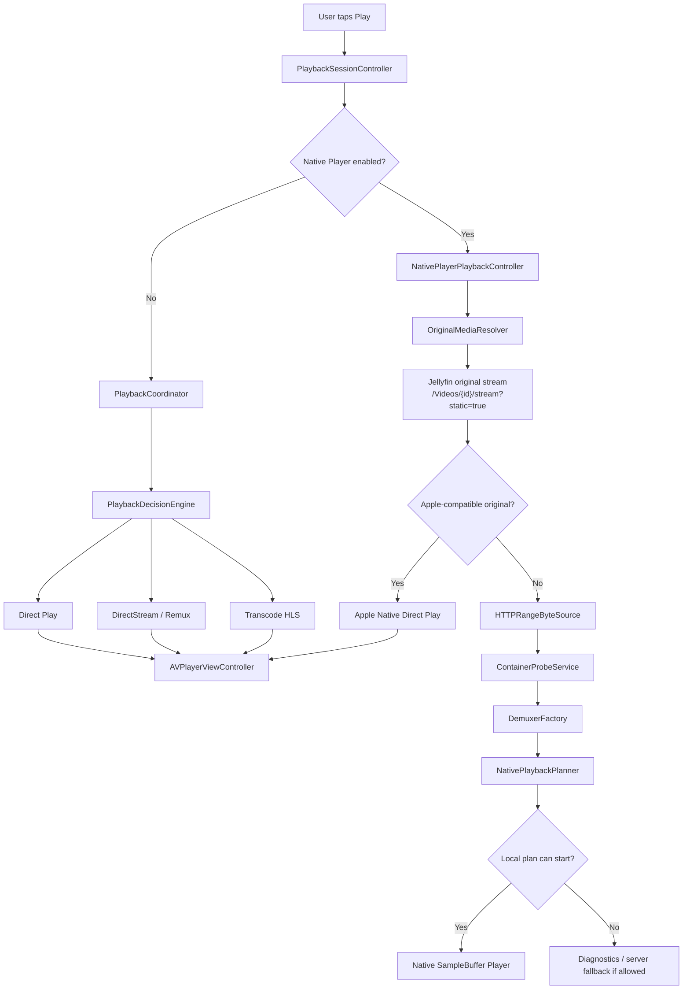
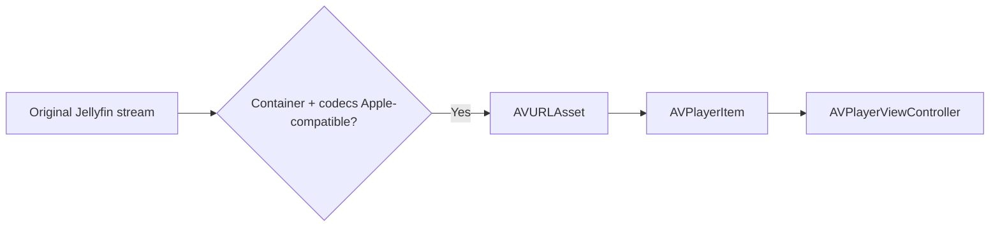
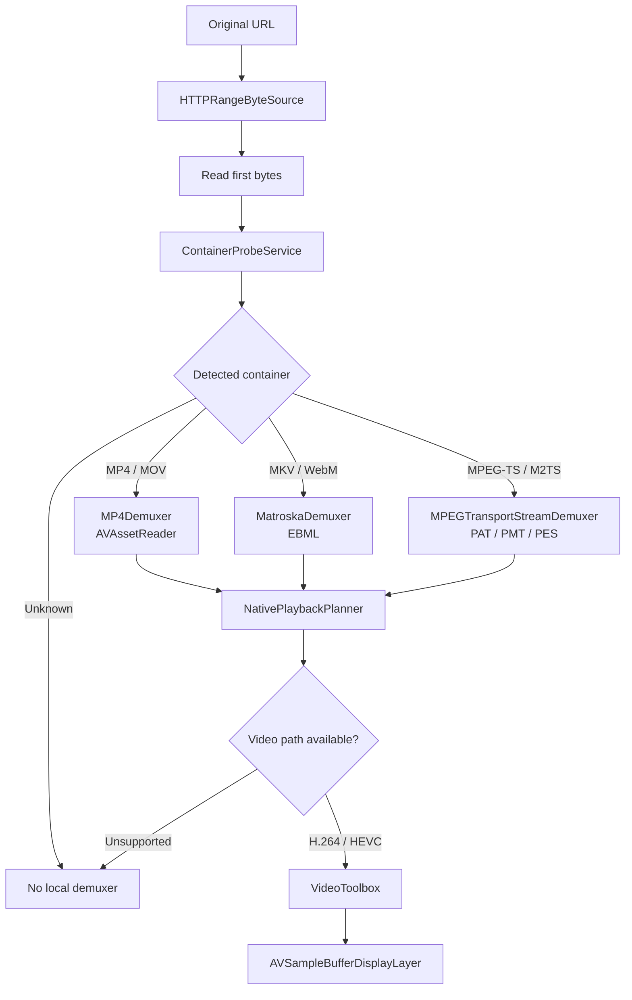
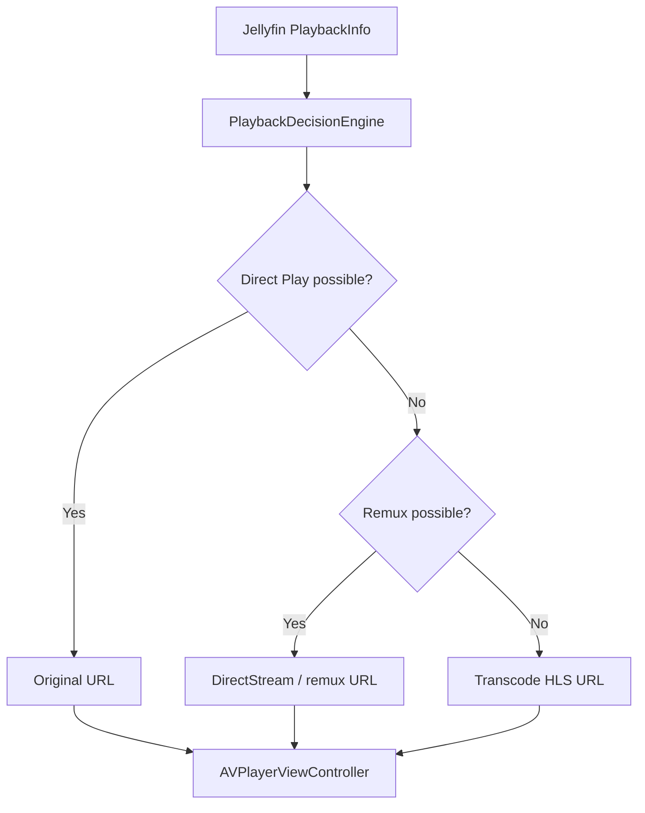

# ReelFin Player Routing

This document explains how ReelFin chooses between Apple playback, the native
SampleBuffer engine, and Jellyfin server fallback paths.

## Quick Summary

ReelFin does not use one universal player for every file. Playback is routed
through the safest available path for the current file, device, and server
response.

| Route | Renderer | Best for | Re-encodes media? |
| --- | --- | --- | --- |
| Apple Native Direct Play | `AVPlayerViewController` | MP4/MOV files already compatible with Apple frameworks | No |
| Native SampleBuffer Engine | `AVSampleBufferDisplayLayer` + `AVSampleBufferAudioRenderer` | Original files that ReelFin can demux locally | No |
| Jellyfin DirectStream / Remux | `AVPlayerViewController` | Files where Jellyfin can repackage without full video transcode | Usually no |
| Jellyfin Transcode HLS | `AVPlayerViewController` | Incompatible containers/codecs or recovery cases | Yes |
| Diagnostics | Native diagnostics overlay | Unsupported local native path | No playback |

## Top-Level Flow

## Route 1: Apple Native Direct Play

Apple Native is the cleanest path. ReelFin gives the original media URL to
AVFoundation and lets `AVPlayerViewController` own playback, controls, HDR
presentation, buffering, media selection, and platform behavior.

Apple Native is selected when the source looks like:

| Dimension | Supported examples |
| --- | --- |
| Container | `mp4`, `m4v`, `mov` |
| Video | `h264`, `avc1`, `avc3`, `hevc`, `h265`, `hvc1`, `hev1`, `dvh1`, `dvhe`, `av1` |
| Audio | `aac`, `ac3`, `eac3`, `mp3`, `flac`, `alac`, `opus` |

Implementation anchors:

- `PlaybackSessionController.prepareNativePlayerPlayback(...)`
- `NativePlayerPlaybackController.shouldUseAppleNativeSurface(...)`
- `PlaybackSessionController.prepareAndLoadSelection(...)`
- `NativePlayerViewController`

## Route 2: Native SampleBuffer Engine

If the original file is not a simple Apple-native container, ReelFin can try the
local native engine. This path reads the original file with HTTP range requests,
probes the container, demuxes packets, plans decoder/render backends, then feeds
compressed samples into Apple rendering primitives.

Current local engine support:

| Container | Local demuxer | Status |
| --- | --- | --- |
| `mp4`, `mov` | `MP4Demuxer` | Supported |
| `mkv`, `matroska` | `MatroskaDemuxer` | Supported, experimental |
| `webm` | `MatroskaDemuxer` | Experimental and codec-limited |
| `mpegTS`, `m2ts` | `MPEGTransportStreamDemuxer` | Supported |
| `avi`, `flv`, `ogg`, `unknown` | None | Unsupported locally |

Current local codec support:

| Track | Works locally | Limited / not complete |
| --- | --- | --- |
| Video | `h264`, `avc1`, `hevc`, `h265`, `hvc1`, `hev1` via VideoToolbox | `av1`, `vp9`, `mpeg2`, `vc1`, `vfw` are planned/missing local software paths |
| Audio | `aac`, `mp3`, `alac`, `ac3`, `eac3`, `flac`, `opus`, `pcm` | `truehd`, `dts`, unknown codecs need software/convert work |
| Subtitles | `srt`, `vtt`, `ass`, `ssa`, Matroska text overlay path | Bitmap subtitles such as `pgs` / `vobsub` are limited and often need server burn-in |

Implementation anchors:

- `HTTPRangeByteSource`
- `ContainerProbeService`
- `DemuxerFactory`
- `NativePlaybackPlanner`
- `NativePlayerView`
- `NativeMP4SampleBufferPlayerView`
- `NativeMatroskaSampleBufferPlayerView`

## Route 3: Jellyfin Remux Or Transcode

When the native route is disabled, or when the standard AVPlayer route is used,
ReelFin asks Jellyfin for playable sources and selects the best server-assisted
path.

Decision priority in the standard route:

1. Direct Play if the original file is already compatible.
2. Capability plan from source metadata and device capabilities.
3. DirectStream / remux if Jellyfin can repackage safely.
4. Transcode if codecs or container are not compatible.
5. Last-resort constructed transcode URL when Jellyfin did not provide one.

Implementation anchors:

- `PlaybackCoordinator.resolvePlayback(...)`
- `PlaybackDecisionEngine.decide(...)`
- `CapabilityEngine.computePlan(...)`
- `PlaybackInfoOptions`

## Practical Examples

| Source file | Likely route | Why |
| --- | --- | --- |
| MP4 + HEVC + E-AC-3 | Apple Native Direct Play | Apple-compatible container and codecs |
| MOV + Dolby Vision + E-AC-3 | Apple Native Direct Play | Apple can own HDR/DV presentation |
| MKV + HEVC + E-AC-3 | Native SampleBuffer or Jellyfin remux | Video/audio are compatible, container needs demux/repackage |
| MKV + HEVC + TrueHD | Native may fail/degrade; server fallback preferred | TrueHD is not a complete local audio path |
| MKV + VP9 | Jellyfin transcode | Local video decoder path is not complete |
| AVI / FLV | Jellyfin transcode | No local demuxer route today |
| PGS subtitles selected | Server burn-in may be required | Bitmap subtitles are not a full local overlay path |

## Why The Router Exists

The router protects three things:

- **Quality:** prefer original Direct Play and avoid unnecessary re-encoding.
- **Reliability:** use Jellyfin transcode/remux when local playback cannot safely start.
- **Platform behavior:** let AVKit handle Apple-native files, HDR, system controls,
  Picture in Picture, and tvOS display criteria when possible.

## Important Constraints

- Native original mode requests the original Jellyfin file first.
- The native SampleBuffer path is local demux/decode/render work, not a third-party
  media engine.
- The dormant NativeBridge / local synthetic HLS path exists in the codebase, but
  should not be documented as a production route unless its route flag changes.
- Server fallback depends on runtime configuration. In debug/native override mode,
  ReelFin can force original-file native playback and disable server transcode fallback.

## Review Checklist

When changing player routing, verify:

- Apple-compatible MP4/MOV does not go through unnecessary probe/demux work.
- MKV/WebM/TS still report useful diagnostics when local playback cannot start.
- Direct Play stays preferred when source and device are compatible.
- Jellyfin transcode fallback remains available for incompatible formats.
- HDR/Dolby Vision paths do not silently downgrade quality in strict modes.
- Track selection does not pick TrueHD/DTS on an Apple-native path when a safer
  AAC/AC-3/E-AC-3 track exists.
