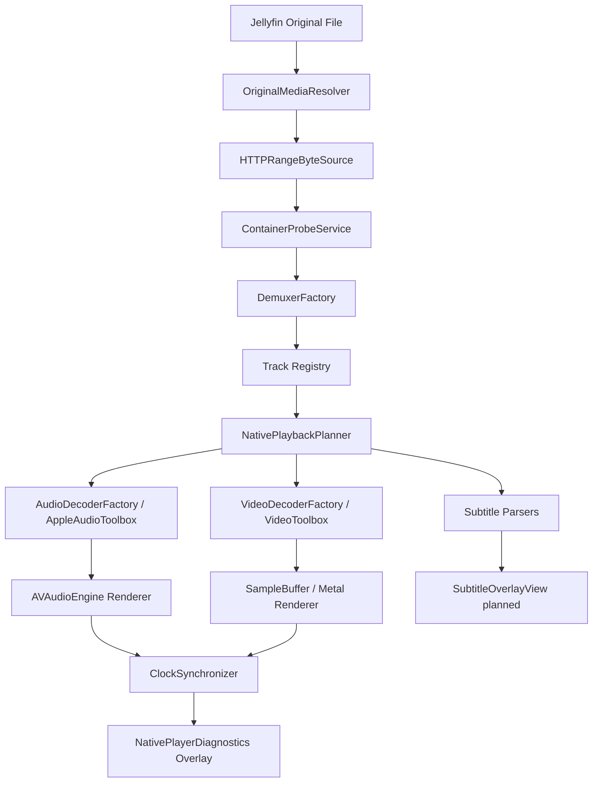

# Native VLC-Class Player Architecture

This branch adds a separate, feature-flagged local media engine path. The existing AVPlayer path remains the production default when `NativeVLCClassPlayerConfig.enabled == false`.

Implemented code lives in `NativeMediaCore/Sources/NativeMediaCore` with integration in `PlaybackEngine/Sources/PlaybackEngine/NativeVLC`.

Current reality: this is an engine foundation, not VLC-level playback. It requests original media, probes bytes, parses basic Matroska metadata/packets, plans local decode backends, and displays diagnostics. Full packet decode/render playback is still incomplete.
