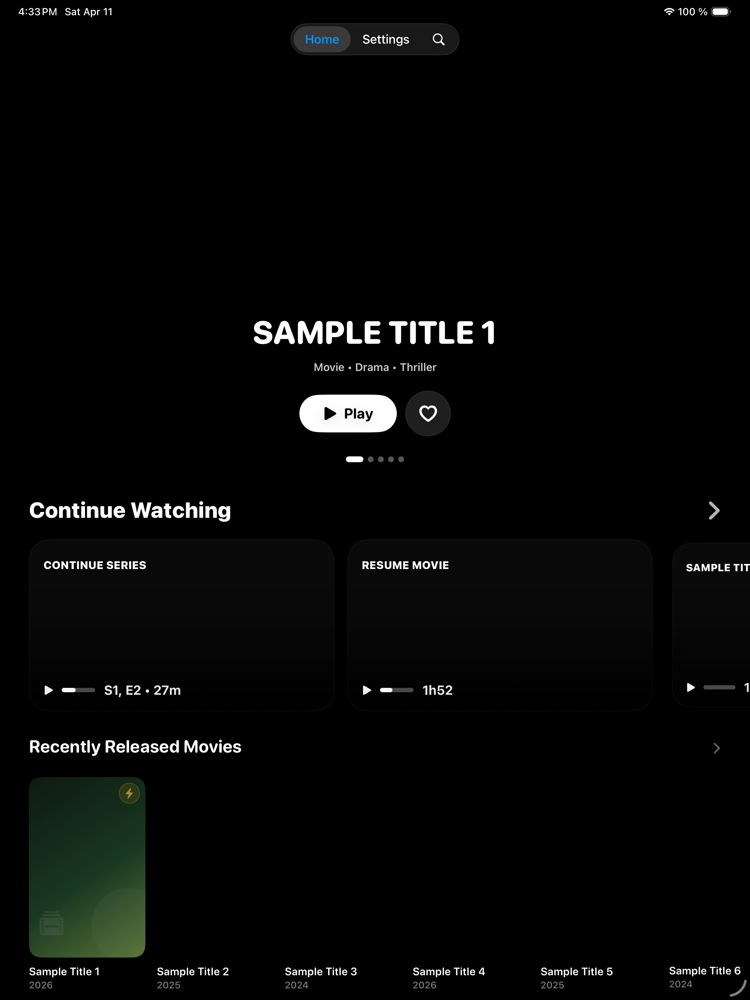
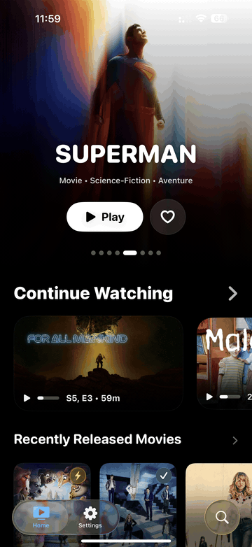
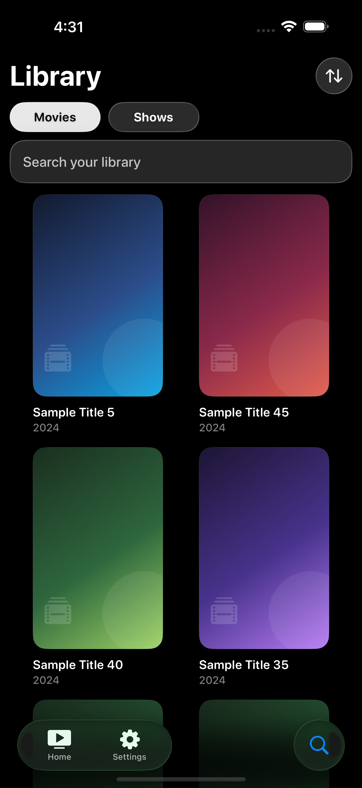
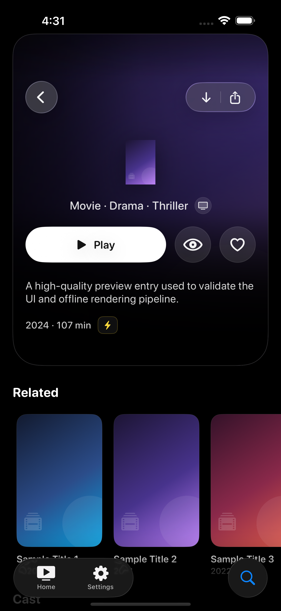
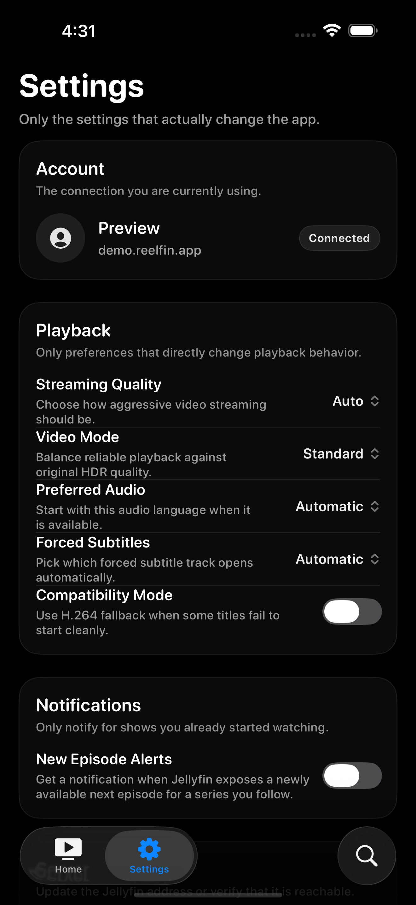
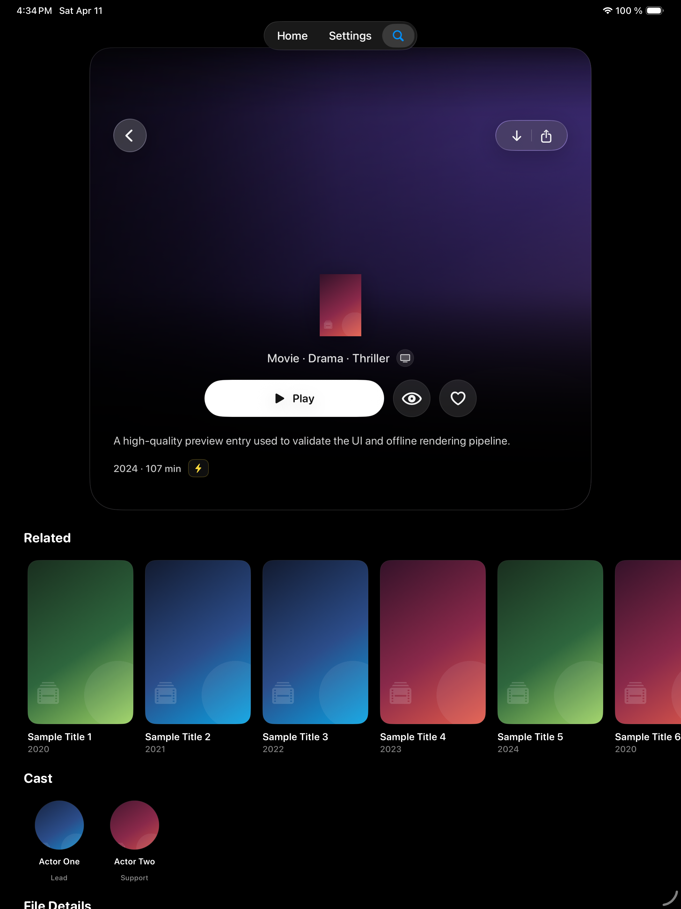

<div align="center">
  
  <h1>ReelFin</h1>
  <p><strong>Native Jellyfin for iPhone, iPad, and Apple TV.</strong></p>
  <p>Browse faster, land on richer detail pages, and keep playback on the Apple stack from end to end.</p>
  <p>
    
    
    
    
  </p>
</div>

ReelFin is a native Jellyfin client built to feel at home on Apple platforms instead of wrapping a server UI in a generic web shell. The app focuses on a clean home feed, fluid library browsing, richer detail pages, and a deterministic playback path based on `AVFoundation`, `AVKit`, and Apple media capabilities.

<p align="center">
  
</p>

<p align="center"><em>Current iPad capture from the repo's screenshot pipeline.</em></p>

## In Motion

<p align="center">
  
</p>

ReelFin already ships with a mock mode and screenshot flow, so the media in this README comes from the current app UI, not from hand-made mockups.

## Why ReelFin

- Native home rails for Continue Watching, Next Up, recently released, and recently added content
- Fast movie and show browsing with dedicated library filters and search
- Detail pages with cast, actions, file details, playback metadata, and watch state controls
- Apple-native playback through `AVPlayer`, direct play first planning, and predictable fallback behavior
- Shared codebase across iPhone, iPad, and Apple TV with platform-specific presentation where it matters
- Local metadata, image caching, sync orchestration, and playback diagnostics built into the app architecture

## Real Screens

<p align="center">
  
  
  
  
</p>

## Apple-First Playback

ReelFin keeps the playback path Apple-native on purpose. Instead of embedding VLC-like stacks, the app resolves the best route for the current media source, prefers direct play when possible, and falls back through explicit compatibility lanes when it has to. That keeps behavior easier to debug, more predictable across devices, and much closer to what the App Store expects from a platform-native media app.

The playback stack lives mainly in:

- `PlaybackEngine` for planning, startup, route selection, local HLS, subtitles, and diagnostics
- `ReelFinUI` for the SwiftUI surfaces, player presentation, and platform-specific UI
- `JellyfinAPI` for networking and DTO decoding
- `DataStore`, `ImageCache`, and `SyncEngine` for persistence, artwork, and background coordination

For the implementation-level playback walkthrough, see [Docs/Playback-Architecture-Current.md](Docs/Playback-Architecture-Current.md).

## Project Map

- `ReelFinApp/`: app entry points and bootstrap wiring
- `ReelFinUI/`: SwiftUI screens, theming, onboarding, and view models
- `PlaybackEngine/`: playback planning, local HLS, native bridge, subtitles
- `JellyfinAPI/`: Jellyfin networking client and decoding
- `DataStore/`: GRDB-backed metadata persistence
- `ImageCache/`: memory and disk image pipeline
- `SyncEngine/`: sync orchestration and background tasks
- `Shared/`: domain models, protocols, settings, logging
- `Tests/`: unit and UI coverage
- `Docs/`: release, support, playback, and legal docs

## Run Locally

### Requirements

- Xcode with iOS 26 simulators installed
- XcodeGen available locally

### Generate the project

```bash
xcodegen generate
```

### Build

```bash
xcodebuild build -project ReelFin.xcodeproj -scheme ReelFin \
  -destination 'platform=iOS Simulator,name=iPhone 17,OS=26.3'

xcodebuild build -project ReelFin.xcodeproj -scheme ReelFinTV \
  -destination 'platform=tvOS Simulator,name=Apple TV 4K (3rd generation),OS=26.1'
```

### Test

```bash
xcodebuild test -project ReelFin.xcodeproj -scheme ReelFin \
  -destination 'platform=iOS Simulator,name=iPhone 17,OS=26.3'
```

### Refresh storefront screenshots

```bash
./scripts/capture_app_store_screenshots.sh
```

## Documentation

- [Docs/README.md](Docs/README.md) for the documentation index
- [Docs/Playback-Architecture-Current.md](Docs/Playback-Architecture-Current.md) for the current playback stack
- [Docs/AppStore-Submission.md](Docs/AppStore-Submission.md) for App Store and TestFlight metadata
- [Docs/TestFlight-Launch-Checklist.md](Docs/TestFlight-Launch-Checklist.md) for the release checklist
- [Docs/AppReview-Notes.md](Docs/AppReview-Notes.md) for review account and review flow notes
- [flovflo.github.io/reelfin-site](https://flovflo.github.io/reelfin-site/) for the public support and policy pages
- [Flovflo/reelfin-site](https://github.com/Flovflo/reelfin-site) for the website source repo

## License

ReelFin is a proprietary, all-rights-reserved codebase.

Copyright (c) 2026 Florian Taffin. All rights reserved.

No permission is granted to use, copy, modify, distribute, sublicense, or create derivative works from this repository without prior written authorization. See `LICENSE` and `COPYRIGHT.md` for the full notice and permission contact.
